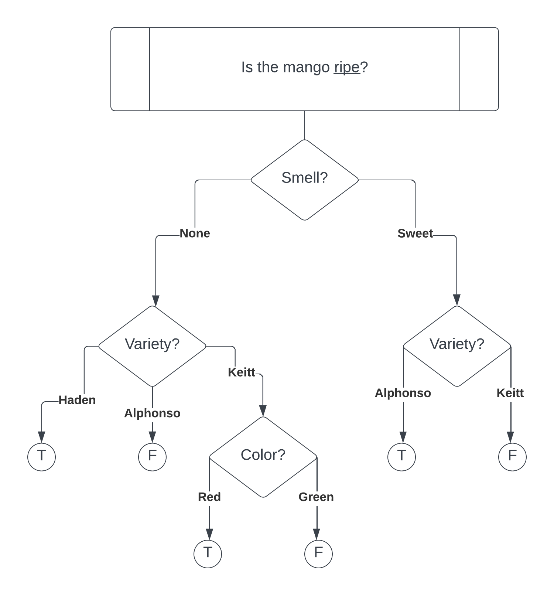

# HW1 Submission

## Description
Homework 1 submission for ML. The img/ directory contains my solution for part 1 question 1.f and the ./data contains the directory for the data files. I didn't have time to make a shell script so I have included the source [jupyter notebook](./hw1_report.ipynb) that I used to make the [report](./hw1_report.pdf) and run the experiments. I used the cade machine's conda 'base' environment.